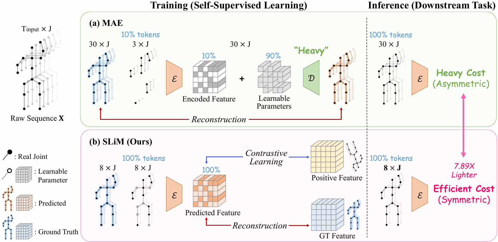
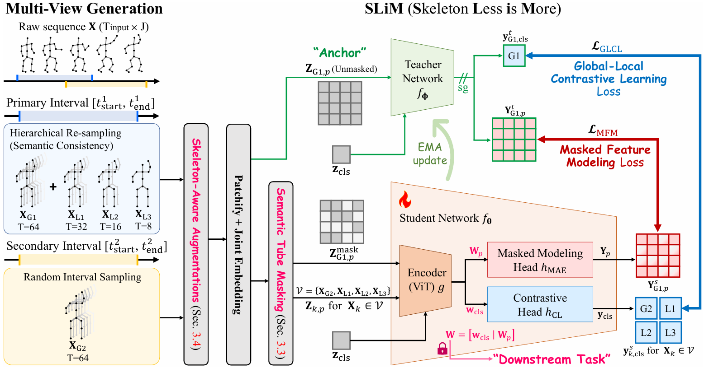
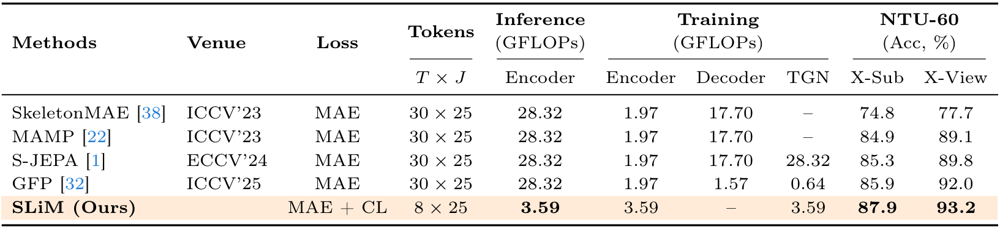

<div align="center">
<h2>Less is More: Decoder-Free Masked Modeling for Efficient Skeleton Representation Learning</h2>

<div>    
    <a href='https://sites.google.com/view/jeonghyeokdo/' target='_blank'>Jeonghyeok Do</a><sup>1</sup>&nbsp&nbsp&nbsp&nbsp;
    <a href='https://scholar.google.com/citations?hl=ko&user=vAUNfCcAAAAJ/' target='_blank'>Yun Chen</a><sup>1</sup>&nbsp&nbsp&nbsp&nbsp;
    <a href='https://sites.google.com/view/geunhyukyouk/' target='_blank'>Geunhyuk Youk</a><sup>1</sup>&nbsp&nbsp&nbsp&nbsp;
    <a href='https://www.viclab.kaist.ac.kr/' target='_blank'>Munchurl Kim</a><sup>1†</sup>
</div>
<br>
<div>
    <sup>†</sup>Corresponding author</span>
</div>
<div>
    <sup>1</sup>Korea Advanced Institute of Science and Technology, South Korea</span>
</div>

<div>
    <h4 align="center">
        <a href="https://kaist-viclab.github.io/SLiM_site/" target='_blank'>
        
        </a>
        <a href="https://arxiv.org/abs/2411.10745" target='_blank'>
        
        </a>
        
    </h4>
</div>
</div>

---

Official PyTorch implementation of **"Less is More: Decoder-Free Masked Modeling for Efficient Skeleton Representation Learning"**.

**SLiM (Skeleton Less is More)** is a unified representation learning framework that bridges the gap between Masked Auto-Encoders (MAE) and Contrastive Learning (CL). 

* 🚀 **Extreme Efficiency:** A completely decoder-free architecture that reduces inference computational costs by **7.89×**.
* 🧠 **Robust Representation:** Introduces **Semantic Tube Masking (STM)** and **Skeleton-Aware Augmentations (SAA)** to capture anatomically consistent motion dynamics without shortcut learning.
* 🏆 **State-of-the-Art:** Achieves peak performance across NTU-60, NTU-120, and PKU-MMD II benchmarks.

---

## SLiM: Decoder-Free Unified Framework


---

## Overview of SLiM Framework


---

## Less Cost, More Accuracy


---

## 📧 News
- **Mar 11, 2026:** This repository is created

---
## Reference
```BibTeX
@article{do2026less,
  title={Less is More: Decoder-Free Masked Modeling for Efficient Skeleton Representation Learning},
  author={Do, Jeonghyeok and Chen, Yun and Youk, Geunhyuk and Kim, Munchurl},
  journal={arXiv preprint arXiv:2411.10745},
  year={2026}
}
```
---

## Results
Please visit our [project page](https://kaist-viclab.github.io/SLiM_site/) for more experimental results.

## Acknowledgements
This repository is built upon [SkateFormer](https://github.com/KAIST-VICLab/SkateFormer/) and [TDSM](https://github.com/KAIST-VICLab/TDSM).