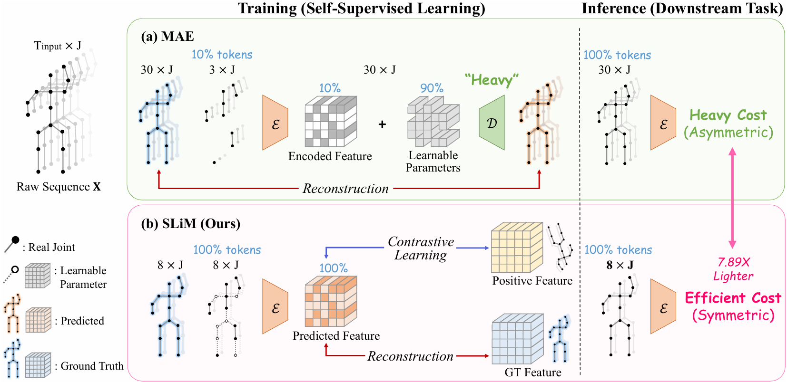
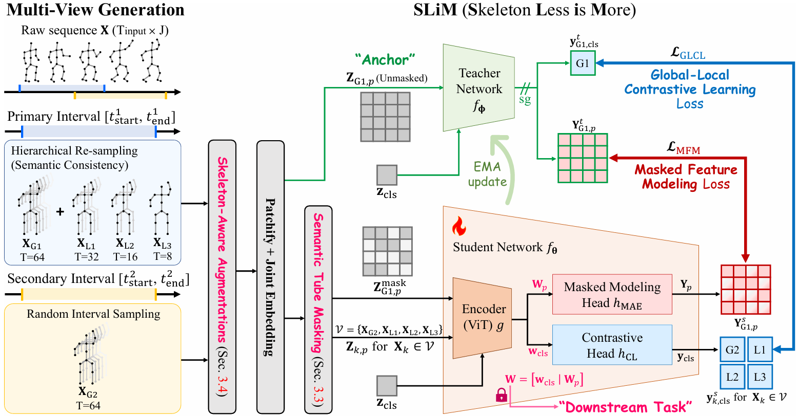
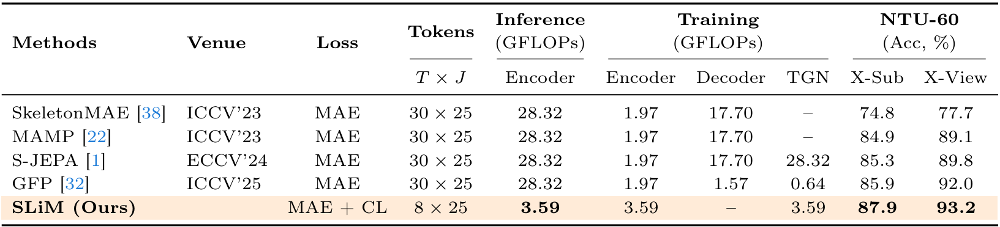

<div align="center">
<h2>Less is More: Compact-Token Masked Feature Learning for Skeleton Representation Learning</h2>

<div>    
    <a href='https://jeonghyeokdo.github.io/' target='_blank'>Jeonghyeok Do</a><sup>1</sup>&nbsp&nbsp&nbsp&nbsp;
    <a href='https://therealchenyun.github.io/' target='_blank'>Yun Chen</a><sup>1</sup>&nbsp&nbsp&nbsp&nbsp;
    <a href='https://geunhyukyouk.github.io/' target='_blank'>Geunhyuk Youk</a><sup>1</sup>&nbsp&nbsp&nbsp&nbsp;
    <a href='https://www.viclab.kaist.ac.kr' target='_blank'>Munchurl Kim</a><sup>1†</sup>
</div>
<br>
<div>
    <sup>†</sup>Corresponding author</span>
</div>
<div>
    <sup>1</sup>Korea Advanced Institute of Science and Technology, South Korea</span>
</div>

<div>
    <h4 align="center">
        <a href="https://kaist-viclab.github.io/SLiM_site/" target='_blank'>
        
        </a>
        <a href="https://arxiv.org/abs/2603.10648" target='_blank'>
        
        </a>
        <a href="https://huggingface.co/JeonghyeokDo" target='_blank'>
        
        </a>
        
    </h4>
</div>
</div>

---

Official PyTorch implementation of **"Less is More: Compact-Token Masked Feature Learning for Skeleton Representation Learning"**.

**SLiM (Skeleton Less is More)** is a unified representation learning framework that bridges the gap between Masked Auto-Encoders (MAE) and Contrastive Learning (CL).

* 🚀 **Extreme Efficiency:** A completely decoder-free architecture that reduces inference computational costs by **7.89×**.
* 🧠 **Robust Representation:** Introduces **Semantic Tube Masking (STM)** and **Skeleton-Aware Augmentations (SAA)** to capture anatomically consistent motion dynamics without shortcut learning.
* 🏆 **State-of-the-Art:** Achieves peak performance across NTU-60, NTU-120, and PKU-MMD II benchmarks.

---

## SLiM: Decoder-Free Unified Framework


---

## Overview of SLiM Framework


---

## Less Cost, More Accuracy


---

## 📧 News
- **Aug 4, 2026:** Code and NTU-60 pre-trained weights released
- **Mar 11, 2026:** This repository is created

---

## Method

SLiM patchifies a 64-frame clip with `P_T = 8`, `P_J = 1` into a compact `8 x 25` token grid and
trains a ViT encoder (8 blocks, dim 256, 8 heads) with two objectives on top of an EMA teacher:

* **MFP** — Masked Feature Prediction: masked student tokens predict the teacher's prototype
  assignment for the same positions. No coordinate decoder is used.
* **GLCL** — Global-Local Contrastive Learning: cross-view prototype matching over CLS tokens.
* **STM** — Semantic Tube Masking: masks are anatomically coherent spatio-temporal tubes rather
  than independent joints.
* **SAA** — Skeleton-Aware Augmentations: bone-aware scaling, skeleton-aware mirroring and rotation.

Naming note: the code descends from DINOv2, so MFP is implemented in the iBOT patch branch
(`ibot.*` config keys, `ibot_head`) and GLCL in the DINO CLS branch (`dino.*`, `dino_head`).

## Installation

```bash
git clone https://github.com/KAIST-VICLab/SLiM.git
cd SLiM
conda create -n slim python=3.9 -y
conda activate slim
pip install torch==2.0.0 --index-url https://download.pytorch.org/whl/cu118
pip install -r requirements.txt
```

Tested with Python 3.9, PyTorch 2.0.0, CUDA 11.8, xFormers 0.0.19 on 4x NVIDIA RTX A6000.
xFormers is **required**: the temporal-RoPE attention used by the SLiM encoder is implemented
only on top of `xformers.ops.memory_efficient_attention`, which is CUDA-only. There is no CPU
path — run the model on a GPU. Loading weights from HuggingFace Hub additionally needs
`pip install huggingface_hub safetensors`.

## Data

Place the preprocessed `.npz` files under `./data` (or point `DATA_ROOT` elsewhere):

```
data/
├── ntu/
│   ├── NTU60_XSub.npz
│   └── NTU60_XView.npz
└── ntu120/
    ├── NTU120_CS.npz     # X-Sub
    └── NTU120_CV.npz     # X-Set
```

Each file holds the standard NTU arrays:

| key | shape | dtype |
| --- | --- | --- |
| `x_train` / `x_test` | `(N, 300, 150)` — 300 frames x (2 people x 25 joints x 3 coords) | float32 |
| `y_train` / `y_test` | `(N, num_classes)` one-hot | int |

The dataset reshapes this to `(N, 3, 300, 25, 2)` internally. Raw NTU RGB+D 60/120 skeletons are
available from [ROSE Lab](https://rose1.ntu.edu.sg/dataset/actionRecognition/); this is the same
preprocessed layout used by CrosSCLR / AimCLR / CMD.

## Pre-trained weights

Encoder-only checkpoints (6.37 M parameters, ~25 MB). The prototype heads are discarded, as they
are at transfer time. One checkpoint per evaluation protocol — the evaluated pre-training
checkpoint with the highest linear accuracy on that protocol — with that protocol's trained
linear probe under `linear/`.

All checkpoints live in one repository, [JeonghyeokDo/SLiM](https://huggingface.co/JeonghyeokDo/SLiM),
one subfolder per protocol:

| subfolder | Protocol | Epoch | Top-1 |
| --- | --- | ---: | ---: |
| `ntu60_xsub`  | NTU-60 X-Sub  | 120 | 87.9 |
| `ntu60_xview` | NTU-60 X-View | 150 | 93.2 |

**NTU-120 weights are coming.** They are being re-exported and re-verified, and will be added to
the same repository as `ntu120_xsub` and `ntu120_xset`.

```python
from slim.hub import SLiMEncoder

model = SLiMEncoder.from_pretrained("JeonghyeokDo/SLiM", subfolder="ntu60_xsub").eval().cuda()
feats = model.get_intermediate_layers(clips, 4, return_class_token=True)  # clips: (B, 3, 64, 25, M)
```

`from_pretrained` also takes a local directory holding `config.json` and `model.safetensors`, so
it works on your own exports (see [Pre-training](#pre-training)). Sanity-check any checkpoint —
downloaded or your own — with:

```bash
python tools/verify_checkpoints.py       # needs a GPU — see the xFormers note above
```

### Trained linear probes

Each subfolder carries the linear-classifier grid trained for the linear-evaluation table under
`linear/`. Download it into `checkpoints/linear/` and the encoder into `checkpoints/`;
evaluating the pair reproduces the reported accuracy without retraining the probe:

```bash
CLASSIFIER=checkpoints/linear/slim_ntu60_best_xsub.pth \
  scripts/eval_linear.sh checkpoints/slim_ntu60_best_xsub.pth outputs/lin_ntu60_xsub ntu60 xsub
```

| Classifier | Encoder | Protocol | Top-1 |
| --- | --- | --- | ---: |
| `slim_ntu60_best_xsub.pth`  | `slim_ntu60_best_xsub.pth`  | NTU-60 X-Sub  | 87.88 |
| `slim_ntu60_best_xview.pth` | `slim_ntu60_best_xview.pth` | NTU-60 X-View | 93.24 |

Retraining a probe from scratch instead lands within ~0.25 points of these values — probe training
depends on data order and on fp16/cuDNN algorithm selection, so small differences between
environments are expected. k-NN retrieval needs no classifier and runs at 72.3 (X-Sub) and
89.8 (X-View) on NTU-60 from the released encoder weights alone.

## Pre-training

Pre-train once per evaluation protocol, on that protocol's **training** clips only (`split=TRAIN`,
labels unused). The protocol's test clips are therefore never seen before evaluation.

```bash
DATA_ROOT=./data scripts/pretrain.sh ntu60_xsub   outputs/slim_ntu60_xsub   0,1,2,3
DATA_ROOT=./data scripts/pretrain.sh ntu60_xview  outputs/slim_ntu60_xview  0,1,2,3
DATA_ROOT=./data scripts/pretrain.sh ntu120_xsub  outputs/slim_ntu120_xsub  0,1,2,3
DATA_ROOT=./data scripts/pretrain.sh ntu120_xset  outputs/slim_ntu120_xset  0,1,2,3
```

| Run | Config | `.npz` | Pre-training clips |
| --- | --- | --- | ---: |
| `ntu60_xsub`  | `slim_ntu60_xsub.yaml`  | `ntu/NTU60_XSub.npz`    | 40,091 |
| `ntu60_xview` | `slim_ntu60_xview.yaml` | `ntu/NTU60_XView.npz`   | 37,646 |
| `ntu120_xsub` | `slim_ntu120_xsub.yaml` | `ntu120/NTU120_CS.npz`  | 63,026 |
| `ntu120_xset` | `slim_ntu120_xset.yaml` | `ntu120/NTU120_CV.npz`  | 54,468 |

Evaluate each encoder on its own protocol only — an encoder pre-trained on the X-Sub training
split has seen clips that appear in the X-View test split, and vice versa.

An epoch is a fixed 1250 iterations (`train.OFFICIAL_EPOCH_LENGTH`) rather than one pass over the
data, so the schedule below and the total compute are the same for every run above; only the
number of passes over the pre-training set changes.

150 epochs, AdamW, base LR `2e-4` with `sqrt_wrt_1024` scaling, 20-epoch warmup, cosine decay to
`1e-6`, effective batch 768 (4 GPUs x 192). Training resumes automatically from the last
checkpoint in the output directory. Teacher checkpoints are written to
`outputs/<run>/eval/training_<iter>/teacher_checkpoint.pth` every 12,500 iterations; export the
encoder from one with:

```bash
python tools/export_encoder.py \
    outputs/slim_ntu60_xsub/eval/training_187499/teacher_checkpoint.pth \
    checkpoints/ntu60_xsub.pth
```

If you change the number of GPUs, adjust `train.batch_size_per_gpu` so the effective batch stays
768, otherwise the scaled learning rate will not match the paper.

## Evaluation

```bash
# Linear evaluation
scripts/eval_linear.sh checkpoints/slim_ntu60_best_xsub.pth  outputs/lin_ntu60_xsub   ntu60  xsub
scripts/eval_linear.sh checkpoints/slim_ntu60_best_xview.pth outputs/lin_ntu60_xview  ntu60  xview
scripts/eval_linear.sh checkpoints/ntu120_xsub.pth  outputs/lin_ntu120_xsub  ntu120 xsub
scripts/eval_linear.sh checkpoints/ntu120_xset.pth  outputs/lin_ntu120_xset  ntu120 xview

# Semi-supervised fine-tuning, 1 % and 10 % of the labels (2 GPUs)
scripts/eval_semi.sh checkpoints/slim_ntu60_best_xsub.pth outputs/semi_001_xsub ntu60 xsub 0.01
scripts/eval_semi.sh checkpoints/slim_ntu60_best_xsub.pth outputs/semi_010_xsub ntu60 xsub 0.1

# Action retrieval, k-NN
scripts/eval_knn.sh checkpoints/slim_ntu60_best_xsub.pth outputs/knn_ntu60_xsub ntu60 xsub
```

`xview` selects X-View on NTU-60 and X-Set on NTU-120. Accuracies are appended to
`<output_dir>/results_eval_linear.json` after every evaluation period.

**Protocols.** Following DINOv2, linear evaluation feeds the frozen encoder into a grid of
linear classifiers — {1, 4} last blocks x {with, without} average-pooled patch tokens x 13
learning rates — trained for 10 epochs x 2000 iterations with SGD (momentum 0.9, batch 16 per
GPU); the best classifier of the grid is reported. Person features are summed over the valid
people in a clip, with padded people masked out. Semi-supervised evaluation fine-tunes the whole
encoder with a single head (last block + avgpool), head LR `1e-3` and backbone LR `1e-5`.

Learning rates are scaled by `batch_size * world_size / 256`, so the **number of GPUs is part of
the recipe**: linear evaluation uses 4 GPUs x batch 16, semi-supervised fine-tuning 2 GPUs x
batch 128. The default GPU lists in the scripts already match; change them and the effective
learning rates change with them.

## Repository layout

```
slim/
├── configs/            default_config.yaml + per-dataset pre-training and eval configs
├── data/
│   ├── augmentations.py    SAA + view sampling (DataAugmentationDINO, DownstreamAugmentation)
│   ├── masking.py          STM (MaskingGenerator)
│   ├── collate.py          view stacking and mask assignment
│   └── datasets/ntu.py     NTU pre-training and classification datasets
├── layers/             ViT blocks, temporal-RoPE attention, prototype head
├── loss/               MFP (iBOTPatchLoss), GLCL (DINOLoss), KoLeo
├── models/             SLiM encoder (vit_tiny: 8 blocks, dim 256, 8 heads)
├── train/              SSLMetaArch (student/teacher, EMA) and the training loop
├── eval/               linear.py, finetune.py (semi-supervised), knn.py (retrieval)
└── hub.py              HuggingFace Hub loading
scripts/                pre-training and evaluation launchers
tools/                  checkpoint export and verification
checkpoints/            exported encoders; linear/ holds trained linear probes
```

---

## Results
Please visit our [project page](https://kaist-viclab.github.io/SLiM_site/) for more experimental results.

## Reference
```BibTeX
@article{do2026less,
  title={Less is More: Compact-Token Masked Feature Learning for Skeleton Representation Learning},
  author={Do, Jeonghyeok and Chen, Yun and Youk, Geunhyuk and Kim, Munchurl},
  journal={arXiv preprint arXiv:2603.10648},
  year={2026}
}
```

## Acknowledgements
This codebase is built upon [DINOv2](https://github.com/facebookresearch/dinov2).

## License
Apache License 2.0, inherited from DINOv2. See [LICENSE](LICENSE).
